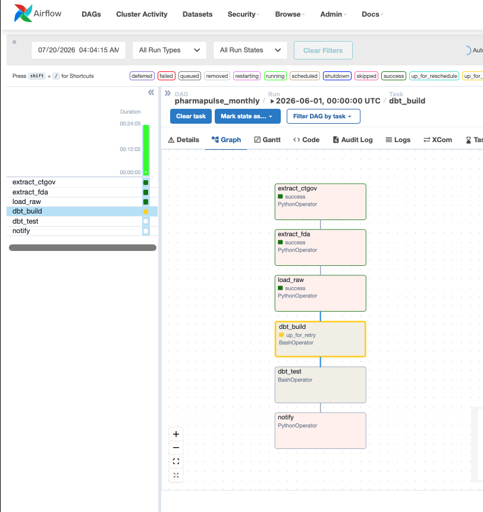

# PharmaPulse

## Artifacts

| Artifact | Link | Status |
|---|---|---|
| 📊 Streamlit explorer  | local only | ✅ |
| 📈 Tableau Public dashboard | [View dashboard](https://public.tableau.com/views/PharmaPulse_17844427223200/Dashboard1) | ✅ live |
| 📚 dbt lineage docs | [GitHub Pages](https://shubhamkragrawal.github.io/pharmpulse/) | ✅ live |
| 🔬 Analysis notebook | [notebooks/01_pharma_analysis.ipynb](../notebooks/01_pharma_analysis.ipynb) | ✅ |
| 📐 KPI framework | [docs/kpi_framework.md](../docs/kpi_framework.md) | ✅ |
| 📋 Executive memo | [docs/executive_memo.md](../docs/executive_memo.md) | ✅ |
| ⚙️ Airflow DAG | [pharmapulse_monthly](http://localhost:8080) - local only |✅ |
| 🔁 dbt CI |  | on PR |
| 🔧 Metric models | `domains/pharma/dbt/models/metrics/` | ✅ |
| 📋 decisions.md | [decisions.md](../decisions.md) | ✅ |

A domain-agnostic ELT warehouse platform — pharma regulatory 
data as the reference implementation.

Pulls from ClinicalTrials.gov (594K+ trials) and openFDA 
(29K+ FDA applications), transforms via dbt into a tested 
star schema, and serves as the data foundation for a 
6-project AI/ML portfolio.

## Current status

#### Done

- ✅ domain-agnostic core/domains scaffold
- ✅ raw extraction layer (594,309 trials, 29,218 FDA applications)
- ✅ dbt staging models (24/24 tests green)
- ✅ star schema marts (118/118 dbt tests green)
- ✅ metrics layer + analysis notebook 
- ✅ Streamlit explorer (8 dashboards) + Tableau CSV extracts + dbt docs CI 
- ✅ KPI framework + executive memo + dbt build CI gate 
- ✅ Airflow orchestration — `pharmapulse_monthly` DAG 

#### To-Do

- PySpark/FAERS appendix (optional)

## Key findings

1. Phase 2 → Phase 3 volume ratios can exceed 100% by construction (Diabetes at 203%) since CT.gov has no trial-lineage field — a directional signal, not a true cohort transition rate.
2. Trial volume is dominated by academic/public institutions (Cairo University leads with 4,739 trials) while industry sponsors dominate by completion success rate (Boehringer Ingelheim, 87.0%).
3. Median trial duration appears to drop sharply after ~2017, but that's right-censoring (still-enrolling trials excluded), not a real speed-up.

See `docs/executive_memo.md` for the full write-up, business implications, and the data enrichment ask that would make all three cuttable by therapeutic area.

## BA Deliverables

- [`docs/kpi_framework.md`](docs/kpi_framework.md) — all 8 dashboard KPIs: business question, exact formula, source model, owner, refresh cadence, known caveats.
- [`docs/executive_memo.md`](docs/executive_memo.md) — 1-page decision memo: 3 key findings and a scoped data-enrichment ask.

## Quick start
```bash
git clone https://github.com/shubhamkragrawal/pharmpulse
cd pharmpulse
uv sync
cp .env.example .env   # fill in your values
make start             # starts Postgres container
make extract           # pulls ClinicalTrials.gov + openFDA
```

## Dashboards

The Streamlit explorer (`streamlit/app.py`) has 8 pages, all reading from the
`marts`/`metrics` schemas only:

1. **Approval Landscape** — FDA approval counts over time, by top applicant, YoY trend.

2. **Phase Funnel** — Phase 2 → Phase 3 → Approval funnel by condition (directional, not literal — see in-page caveat).

3. **Sponsor League Table** — sortable, filterable table of every sponsor's trial volume and success rate.

4. **Duration Trends** — median trial duration YoY with p25/p75 bands, plus a by-phase cut.

5. **Sponsor Cohorts** — survivorship curves: how long sponsors stay active after their first trial.

6. **Termination Reasons** — why trials stop early, by phase, by sponsor class, and by stated reason.

7. **Phase Distribution** — how the industry's trial-phase mix has shifted since CT.gov launched in 2000.

8. **Pipeline Trust** — scorecard: how much to trust each of the other 7 dashboards, and why.


**Access control:** the Streamlit explorer connects via a read-only Postgres
role (`pharmapulse_readonly`) scoped to the `marts` and `metrics` schemas only
— no `raw` or `staging` access. This is a portfolio-appropriate
simplification, not production access control: no SSO, no row-level
security. A production deployment would use both.

Run locally:
```bash
make create-readonly-role   # one-time, after setting password in .env
make streamlit               # runs on http://localhost:8501
```
Or via Docker: `docker compose up -d streamlit` (after `make create-readonly-role`).

## Tableau Public Dashboard

An executive-facing summary of the clinical trial landscape, built from the
same marts/metrics layer as the Streamlit explorer but designed for a
non-technical audience — three dashboards, no filters, findings-first layout.

**Three dashboards:**
- **Industry Overview** — approval volume over time, top FDA applicants,
  how the trial landscape has grown since CT.gov launched in 2000
- **Trial Success & Failure** — phase funnel (Phase 2 → Phase 3 → Approval)
  across top conditions, termination rates by phase, stated reasons trials stop
- **Sponsor Intelligence** — cohort survivorship curves (how long sponsors
  stay active after their first trial), league table of top 50 sponsors by
  trial volume and success rate

**Built from:** `data/tableau_extracts/*.csv` — regenerate anytime with
`make tableau-extracts` after a dbt build.

**Note:** approval counts include generics/ANDAs (FDA namespace); phase
transition rates are directional/relative-volume ratios, not true cohort
probabilities — see the Pipeline Trust dashboard in the Streamlit explorer
for the full data-quality context.

## Orchestration (Airflow)

`pharmapulse_monthly` (`airflow/dags/pharmapulse_monthly.py`) runs the full
pipeline on a monthly schedule: `extract_ctgov >> extract_fda >> load_raw >>
dbt_build >> dbt_test >> notify`. LocalExecutor, single node — retries=2
with exponential backoff, a 6-hour SLA on `dbt_test`, and a failure
callback stubbed for Slack (`SLACK_WEBHOOK_URL`, not wired yet).

```bash
make airflow-init   # one-time: creates the airflow metadata DB + admin user
make airflow-up      # starts webserver + scheduler
```

Airflow UI: http://localhost:8080

DAG graph screenshot: 

Kill/retry and failure-callback proof: see `airflow/KILL_RETRY_PROOF.md`.

## Architecture
Domain-agnostic core (`core/`) + pharma-specific implementation 
(`domains/pharma/`). 

See `decisions.md` for every non-trivial engineering decision 
made during the build, with failure modes and scaling notes.

## Part of a larger portfolio

PharmaPulse is the data foundation for a multi-project AI/ML 
portfolio — every downstream project (ML prediction, NER, 
agentic RAG, causal inference, open benchmarking) reads 
from this warehouse.

Full portfolio: [coming soon]
