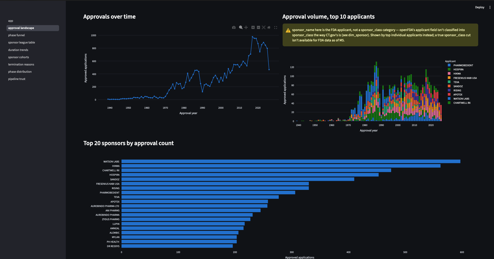
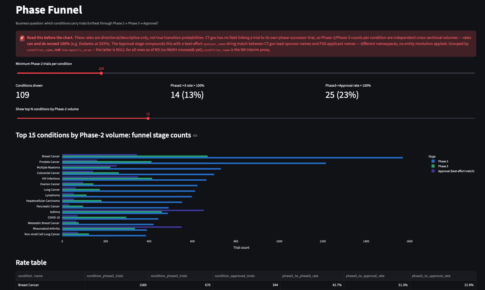
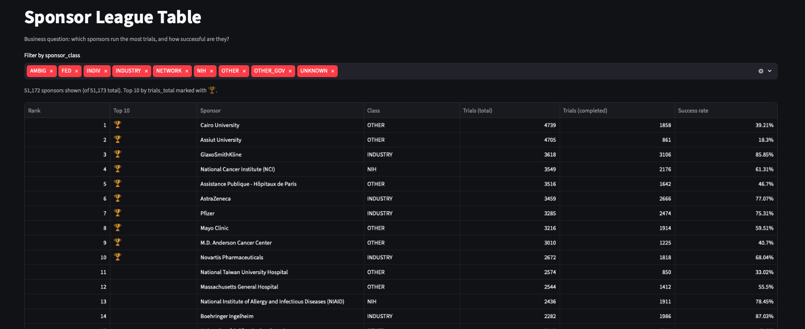
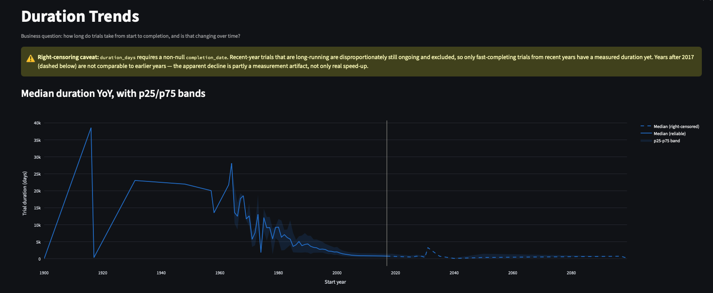
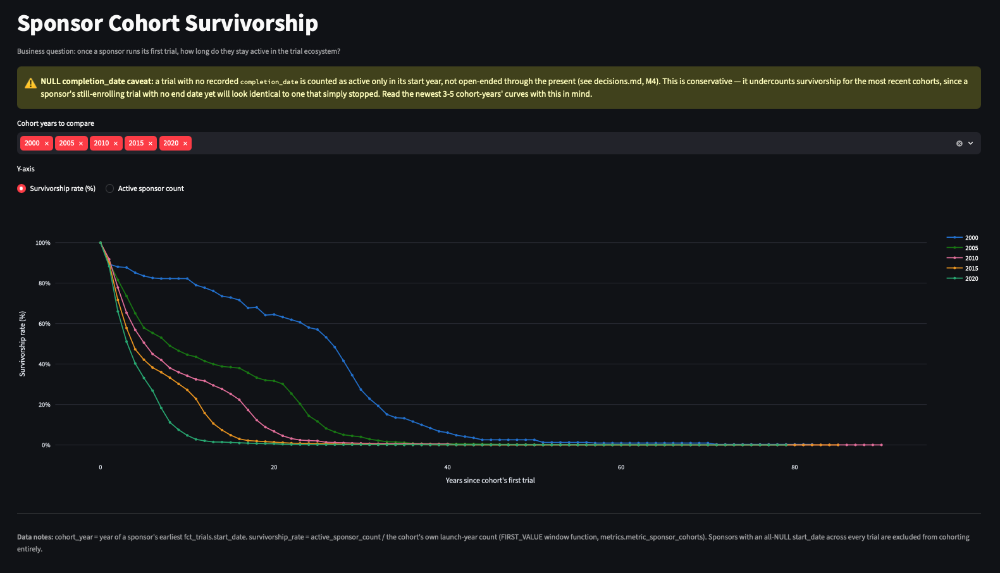
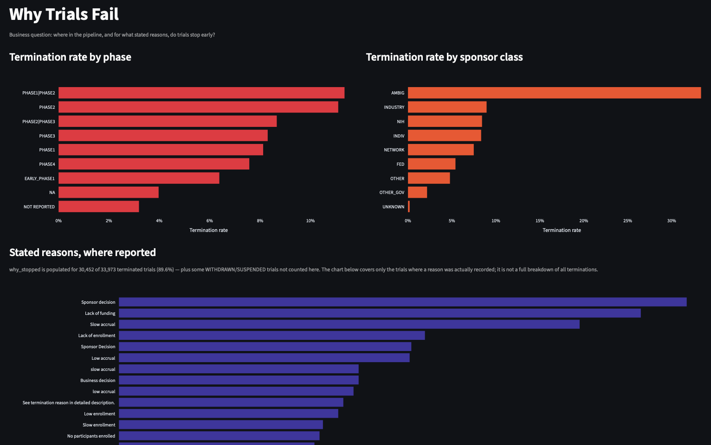
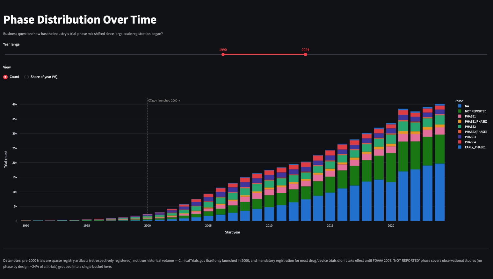
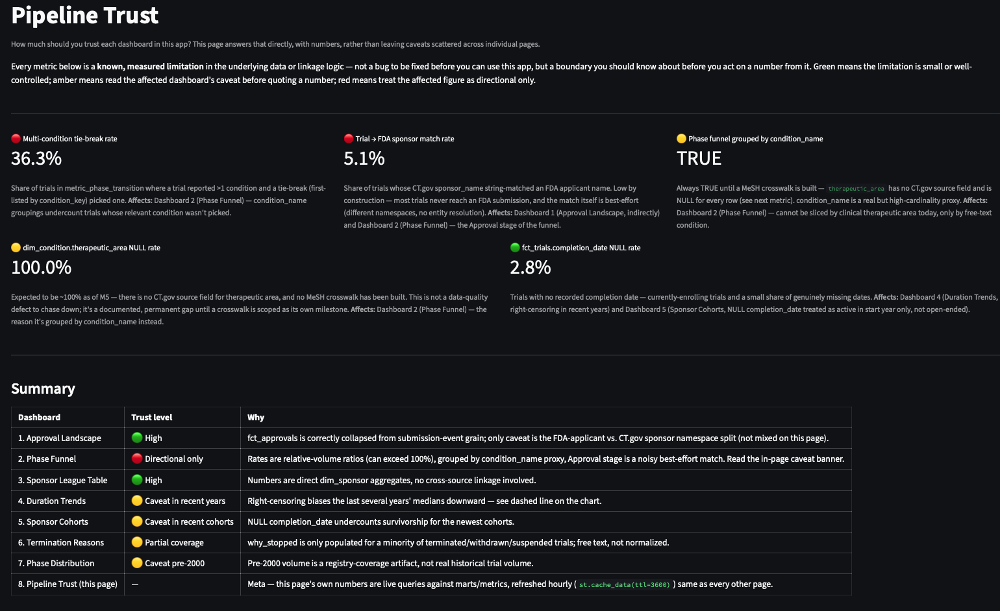

# PharmaPulse

A domain-agnostic ELT warehouse platform — pharma regulatory 
data as the reference implementation.

Pulls from ClinicalTrials.gov (594K+ trials) and openFDA 
(29K+ FDA applications), transforms via dbt into a tested 
star schema, and serves as the data foundation for a 
6-project AI/ML portfolio.

## Live artifacts

📊 Streamlit explorer: http://localhost:8501 (local) | `<deploy URL TBD>`
📈 Tableau Public dashboard: `<URL TBD — publish manually>`
📚 dbt lineage docs: https://github.com/shubhamkragrawal/pharmpulse/deployments/github-pages

## Current status

#### Done

- ✅ domain-agnostic core/domains scaffold
- ✅ raw extraction layer (594,309 trials, 29,218 FDA applications)
- ✅ dbt staging models (24/24 tests green)
- ✅ star schema marts (118/118 dbt tests green)
- ✅ metrics layer + analysis notebook (M4)
- ✅ Streamlit explorer (8 dashboards) + Tableau CSV extracts + dbt docs CI (M5)

#### To-Do

- Airflow orchestration
- PySpark/FAERS appendix (optional)

## Quick start
```bash
git clone https://github.com/shubhamkragrawal/pharmpulse
cd pharmpulse
uv sync
cp .env.example .env   # fill in your values
make start             # starts Postgres container
make extract           # pulls ClinicalTrials.gov + openFDA
```

## Dashboards

The Streamlit explorer (`streamlit/app.py`) has 8 pages, all reading from the
`marts`/`metrics` schemas only:

1. **Approval Landscape** — FDA approval counts over time, by top applicant, YoY trend.

2. **Phase Funnel** — Phase 2 → Phase 3 → Approval funnel by condition (directional, not literal — see in-page caveat).

3. **Sponsor League Table** — sortable, filterable table of every sponsor's trial volume and success rate.

4. **Duration Trends** — median trial duration YoY with p25/p75 bands, plus a by-phase cut.

5. **Sponsor Cohorts** — survivorship curves: how long sponsors stay active after their first trial.

6. **Termination Reasons** — why trials stop early, by phase, by sponsor class, and by stated reason.

7. **Phase Distribution** — how the industry's trial-phase mix has shifted since CT.gov launched in 2000.

8. **Pipeline Trust** — scorecard: how much to trust each of the other 7 dashboards, and why.


**Access control:** the Streamlit explorer connects via a read-only Postgres
role (`pharmapulse_readonly`) scoped to the `marts` and `metrics` schemas only
— no `raw` or `staging` access. This is a portfolio-appropriate
simplification, not production access control: no SSO, no row-level
security. A production deployment would use both.

Run locally:
```bash
make create-readonly-role   # one-time, after setting password in .env
make streamlit               # runs on http://localhost:8501
```
Or via Docker: `docker compose up -d streamlit` (after `make create-readonly-role`).

## Tableau

`scripts/export_tableau_extracts.py` exports one CSV per dashboard to
`data/tableau_extracts/` (gitignored — regenerate locally, don't expect them
in a fresh clone). These CSVs are the source for the Tableau Public
dashboard, which is built manually (Tableau isn't something Claude Code can
build directly — see decisions.md for the Streamlit-vs-Tableau rationale).

```bash
make tableau-extracts   # regenerate after any dbt build
```

## Architecture
Domain-agnostic core (`core/`) + pharma-specific implementation 
(`domains/pharma/`). Adding a second domain = new folder, 
zero changes to core.

See `decisions.md` for every non-trivial engineering decision 
made during the build, with failure modes and scaling notes.

## Part of a larger portfolio

PharmaPulse is the data foundation for a multi-project AI/ML 
portfolio — every downstream project (ML prediction, NER, 
agentic RAG, causal inference, open benchmarking) reads 
from this warehouse.

Full portfolio: [coming soon]